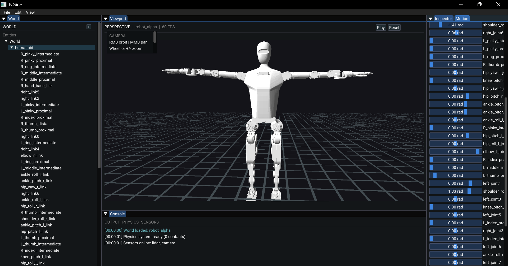

# NGine

NGine is a C++20 OpenGL robot visualization and editor application. The project uses GLFW, GLAD, Dear ImGui, GLM, Assimp, TinyXML-2, and stb. These dependencies are included in the repository under `vendors/`.



## Requirements

The Windows build is tested with MSYS2 UCRT64 and requires:

- Git
- CMake 3.20 or newer
- GCC with C++20 support
- GNU Make or Ninja

The application also requires an OpenGL 4.6 capable graphics driver.

## Install Build Tools on Windows

Install [MSYS2](https://www.msys2.org/), then open the **MSYS2 UCRT64** terminal and update the package database:

```bash
pacman -Syu
```

Close and reopen the MSYS2 UCRT64 terminal if MSYS2 asks you to do so, then update again:

```bash
pacman -Su
```

Install Git, CMake, and the UCRT64 GCC toolchain:

```bash
pacman -S --needed \
	git \
	mingw-w64-ucrt-x86_64-toolchain \
	mingw-w64-ucrt-x86_64-cmake \
	mingw-w64-ucrt-x86_64-ninja
```

Verify the tools:

```bash
g++ --version
cmake --version
git --version
```

## Download the Repository

Clone the repository recursively so Git also downloads any submodules:

```bash
git clone --recurse-submodules <repository-url> ngine
cd ngine
```

If the repository was already cloned without recursive submodules, initialize them with:

```bash
git submodule update --init --recursive
```

## Configure and Build

Run these commands from the repository root, where `CMakeLists.txt`, `resources/`, and `shaders/` are located:

```bash
cmake -S . -B build -G Ninja -DCMAKE_BUILD_TYPE=Release
cmake --build build
```

The executable and copied runtime assets are placed in:

```text
build/ngine.exe
build/shaders/
build/resources/
```

To rebuild after making code changes:

```bash
cmake --build build
```

To regenerate the build directory after adding or removing source files:

```bash
cmake -S . -B build -G Ninja -DCMAKE_BUILD_TYPE=Release
```

## Run

Run the executable from the repository root so the relative shader, font, and robot model paths resolve correctly:

```bash
./build/ngine.exe
```

The editor opens with the robot scene. The viewport supports camera orbit, panning, zooming, joint controls, and the current demo animation controls.

## Build Directory Cleanup

If CMake reports stale generator or configuration errors, remove the build directory and configure it again:

```bash
rm -rf build
cmake -S . -B build -G Ninja -DCMAKE_BUILD_TYPE=Release
cmake --build build
```

On PowerShell, use this equivalent cleanup command:

```powershell
Remove-Item -Recurse -Force build
cmake -S . -B build -G Ninja -DCMAKE_BUILD_TYPE=Release
cmake --build build
```
