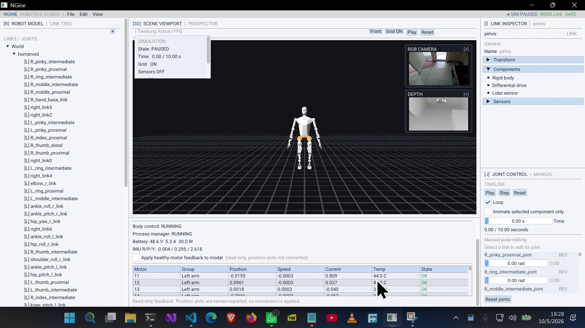

# NGine

NGine is a C++20 OpenGL robot visualization and editor application. It renders a robot model in an interactive editor and can display live, read-only telemetry from the robot's ROS 2 computer.



## Table of Contents

- [Overview](#overview)
- [Requirements](#requirements)
- [Installation (Windows)](#installation-windows)
- [Build](#build)
- [Run](#run)
- [ROS 2 Telemetry Bridge](#ros-2-telemetry-bridge)
- [Troubleshooting](#troubleshooting)

## Overview

**Target robot**


**Screen recordings**

Short recordings showing the app running (a proof of life). They do not cover every feature.

- [App screen recording](Docs/ScreenRecordingOfAppUpdated.mp4)
- [Camera preview recording](Docs/CameraRecordingOfApp.mp4)

**Features**

- Camera orbit, pan, and zoom
- Joint controls and demo animation controls
- Live read-only motor, power, IMU, and controller-state telemetry
- RGB and depth camera previews

**Dependencies** (all vendored under `vendors/`): GLFW, GLAD, Dear ImGui, GLM, Assimp, TinyXML-2, stb.

## Requirements

- Git
- CMake 3.20+
- GCC with C++20 support
- GNU Make or Ninja
- A graphics driver supporting OpenGL 4.6

The Windows build is tested with MSYS2 UCRT64.

## Installation (Windows)

1. Install [MSYS2](https://www.msys2.org/) and open the **MSYS2 UCRT64** terminal.
2. Update the package database. Restart the terminal if prompted, then run the second command:

   ```bash
   pacman -Syu
   pacman -Su
   ```

3. Install the toolchain:

   ```bash
   pacman -S --needed \
       git \
       mingw-w64-ucrt-x86_64-toolchain \
       mingw-w64-ucrt-x86_64-cmake \
       mingw-w64-ucrt-x86_64-ninja
   ```

4. Verify:

   ```bash
   g++ --version
   cmake --version
   git --version
   ```

5. Clone the repository with submodules:

   ```bash
   git clone --recurse-submodules https://github.com/lewis-2000/ngine
   cd ngine
   ```

   If you already cloned without submodules:

   ```bash
   git submodule update --init --recursive
   ```

## Build

Run from the repository root (where `CMakeLists.txt`, `resources/`, and `shaders/` live):

```bash
cmake -S . -B build -G Ninja -DCMAKE_BUILD_TYPE=Release
cmake --build build
```

Output:

```text
build/ngine.exe
build/shaders/
build/resources/
```

| Task | Command |
| --- | --- |
| Rebuild after code changes | `cmake --build build` |
| Regenerate after adding/removing source files | `cmake -S . -B build -G Ninja -DCMAKE_BUILD_TYPE=Release` |

## Run

Run from the repository root so relative shader, font, and model paths resolve:

```bash
./build/ngine.exe
```

## ROS 2 Telemetry Bridge

NGine can display live telemetry from the robot's ROS 2 computer. The relay is **read-only**: it subscribes to ROS 2 feedback topics and never publishes motor commands or calls motor services.

### Placeholders used below

| Placeholder | Meaning |
| --- | --- |
| `<ROBOT_USER>` | Username on the robot's Ubuntu computer |
| `<ROBOT_IP>` | IP address of the robot's Ubuntu computer |
| `<PORT>` | Relay TCP port (example: `8765`) |
| `<NGINE_REPO>` | Path to your local NGine checkout |
| `<VENDOR_WS>` | Path to the robot vendor's ROS 2 workspace |

### 1. Copy the relay to the robot

From PowerShell in the NGine repository:

```powershell
scp <NGINE_REPO>\scripts\ros2_telemetry_relay.py <ROBOT_USER>@<ROBOT_IP>:~/
```

### 2. Start the relay on the robot

```powershell
ssh <ROBOT_USER>@<ROBOT_IP>
```

Then, in the Ubuntu shell:

```bash
source /opt/ros/humble/setup.bash
source <VENDOR_WS>/install/setup.bash
python3 ~/ros2_telemetry_relay.py --bind 0.0.0.0 --port <PORT> --rate 20 --camera-rate 1 --depth-scale 4
```

> `--bind 0.0.0.0` listens on all interfaces. Use this only on a trusted network, or bind to a specific interface address instead.

**Stream selection.** By default both RGB and depth are forwarded. Disabled streams are not subscribed to, decoded, or transmitted.

| Mode | Extra flags |
| --- | --- |
| RGB only | `--disable-depth` |
| Depth only | `--disable-camera` |
| Motor/state telemetry only | `--disable-camera --disable-depth` |

Keep this terminal open. If NGine disconnects or restarts, the relay keeps its ROS subscriptions and waits for the next connection on the same port.

### 3. Build and run NGine

In a second PowerShell terminal:

```powershell
cd <NGINE_REPO>
cmake --build build --config Release --parallel 1
cd build
.\ngine.exe
```

### 4. Connect in the editor

1. Open **View > Robot telemetry** and click **Connect**.
2. Confirm the panel shows **LIVE DATA** and increasing frame counts.
3. Open **View > Camera preview** to see the RGB stream.
4. Optionally enable **Apply healthy motor feedback to model**.

The last option applies healthy, read-only motor positions to the simulated robot for visual comparison. Nothing is sent back to ROS 2. Position values are shown and applied as vendor-reported values; no degree/radian conversion is performed.

### Camera streams

| Stream | ROS topic | Format |
| --- | --- | --- |
| RGB | `/camera/color/image_raw/compressed` | JPEG |
| Depth | `/camera/depth/image_raw` | `16UC1`, downsampled 4x per dimension |

- Both are rate-limited to 1 frame per second by default.
- Use the **RGB** and **Depth** tabs in the camera preview; aspect ratios are preserved.
- RGB falls back to the local camera preview if no ROS frame is available.
- The detailed preview reports received frame dimensions but does not request higher resolution. The relay keeps only the newest frame, so opening it adds no network or decode load.

Protocol and safety details: [Docs/ros2-bridge-read-only-reference.md](Docs/ros2-bridge-read-only-reference.md).

## Troubleshooting

**Cannot connect to the relay.** Test the port from Windows:

```powershell
Test-NetConnection <ROBOT_IP> -Port <PORT>
```

The result should contain `TcpTestSucceeded : True`.

**Stale CMake generator or configuration errors.** Remove the build directory and reconfigure.

Bash:

```bash
rm -rf build
cmake -S . -B build -G Ninja -DCMAKE_BUILD_TYPE=Release
cmake --build build
```

PowerShell:

```powershell
Remove-Item -Recurse -Force build
cmake -S . -B build -G Ninja -DCMAKE_BUILD_TYPE=Release
cmake --build build
```