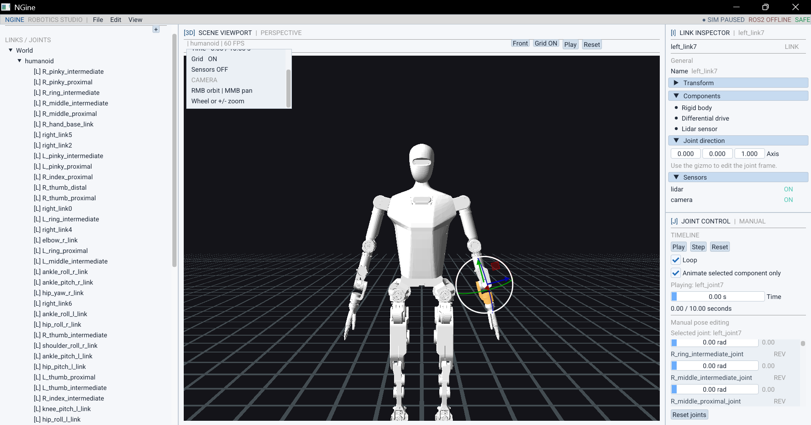
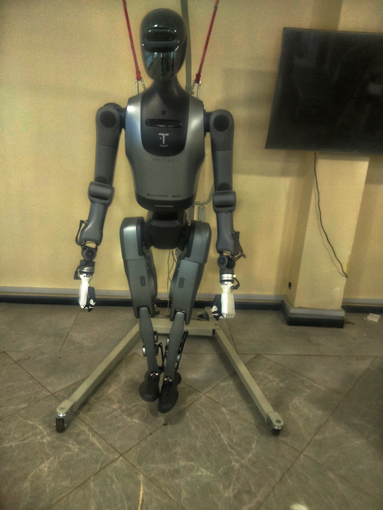

# NGine

NGine is a C++20 OpenGL robot visualization and editor application. The project uses GLFW, GLAD, Dear ImGui, GLM, Assimp, TinyXML-2, and stb. These dependencies are included in the repository under `vendors/`.



## Here is an image of the robot this program is meant for


## Requirements

The Windows build is tested with MSYS2 UCRT64 and requires:

- Git
- CMake 3.20 or newer
- GCC with C++20 support
- GNU Make or Ninja

The application also requires an OpenGL 4.6 capable graphics driver.

## Install Build Tools on Windows

Install [MSYS2](https://www.msys2.org/), then open the **MSYS2 UCRT64** terminal and update the package database:

```bash
pacman -Syu
```

Close and reopen the MSYS2 UCRT64 terminal if MSYS2 asks you to do so, then update again:

```bash
pacman -Su
```

Install Git, CMake, and the UCRT64 GCC toolchain:

```bash
pacman -S --needed \
	git \
	mingw-w64-ucrt-x86_64-toolchain \
	mingw-w64-ucrt-x86_64-cmake \
	mingw-w64-ucrt-x86_64-ninja
```

Verify the tools:

```bash
g++ --version
cmake --version
git --version
```

## Download the Repository

Clone the repository recursively so Git also downloads any submodules:

```bash
git clone --recurse-submodules https://github.com/lewis-2000/ngine
cd ngine
```

If the repository was already cloned without recursive submodules, initialize them with:

```bash
git submodule update --init --recursive
```

## Configure and Build

Run these commands from the repository root, where `CMakeLists.txt`, `resources/`, and `shaders/` are located:

```bash
cmake -S . -B build -G Ninja -DCMAKE_BUILD_TYPE=Release
cmake --build build
```

The executable and copied runtime assets are placed in:

```text
build/ngine.exe
build/shaders/
build/resources/
```

To rebuild after making code changes:

```bash
cmake --build build
```

To regenerate the build directory after adding or removing source files:

```bash
cmake -S . -B build -G Ninja -DCMAKE_BUILD_TYPE=Release
```

## Run

Run the executable from the repository root so the relative shader, font, and robot model paths resolve correctly:

```bash
./build/ngine.exe
```

The editor opens with the robot scene. The viewport supports camera orbit, panning, zooming, joint controls, and the current demo animation controls.

## Read-only ROS 2 telemetry bridge

NGine can display live, read-only motor, power, IMU, and controller-state
telemetry from the robot's ROS 2 computer. The relay subscribes to ROS 2
feedback topics only; it does not publish motor commands or call motor
services.

The current setup expects the Ubuntu host at `192.168.41.1` and TCP port
`8765`.

### 1. Copy the relay to Ubuntu

Run this from a Windows PowerShell terminal in the NGine repository:

```powershell
scp C:\Users\flamm\Dev\Graphics\ngine\scripts\ros2_telemetry_relay.py ubuntu@192.168.41.1:/home/ubuntu/
```

Enter the Ubuntu user's password when prompted.

### 2. Start the relay on Ubuntu

Connect to the host:

```powershell
ssh ubuntu@192.168.41.1
```

Then run these commands in the Ubuntu shell:

```bash
source /opt/ros/humble/setup.bash
source /home/ubuntu/ros2_tg/src/x86/benti/TG2.0-Plus_linux-x86_ros2-general_v2.0.7_20260527_155108/install/setup.bash
python3 /home/ubuntu/ros2_telemetry_relay.py --bind 0.0.0.0 --port 8765 --rate 20 --camera-rate 1 --depth-scale 4
```

The RGB and depth streams can be selected independently. Use one of these
options when starting the relay:

```bash
# RGB camera only
python3 /home/ubuntu/ros2_telemetry_relay.py --bind 0.0.0.0 --port 8765 --rate 20 --camera-rate 1 --disable-depth

# Depth only
python3 /home/ubuntu/ros2_telemetry_relay.py --bind 0.0.0.0 --port 8765 --rate 20 --camera-rate 1 --depth-scale 4 --disable-camera

# Motor/state telemetry only
python3 /home/ubuntu/ros2_telemetry_relay.py --bind 0.0.0.0 --port 8765 --rate 20 --disable-camera --disable-depth
```

The default is to forward both RGB and depth. Disabled streams are not
subscribed to, decoded, or transmitted, which avoids their performance cost.

Keep this SSH terminal running. The relay reports when NGine connects. If
NGine disconnects or is restarted, the relay keeps its ROS subscriptions alive
and waits for the next connection on the same port.

### 3. Start NGine and connect

In a second Windows PowerShell terminal, rebuild and run NGine:

```powershell
cd C:\Users\flamm\Dev\Graphics\ngine
cmake --build C:\Users\flamm\Dev\Graphics\ngine\build --config Release --parallel 1
cd C:\Users\flamm\Dev\Graphics\ngine\build
.\ngine.exe
```

In the editor:

1. Open **View > Robot telemetry**.
2. Click **Connect**.
3. Confirm that the panel shows **LIVE DATA** and increasing frame counts.
4. Open **View > Camera preview** to see the read-only RGB stream.
5. Enable **Apply healthy motor feedback to model** if model feedback is also
   wanted.

The last option applies healthy, read-only motor positions to the simulated
robot for visual comparison. It does not send anything back to ROS 2. Position
values are currently shown and applied as vendor-reported values; no
degree/radian conversion is performed.

The camera preview subscribes to `/camera/color/image_raw/compressed` and the
depth preview subscribes to `/camera/depth/image_raw` through the relay. RGB
frames are JPEG-encoded. Depth frames are downsampled by four in each
dimension and forwarded as read-only `16UC1` data. Both are rate-limited to
one frame per second by default. Use the
**RGB** and **Depth** tabs in the camera preview. The previews preserve their
camera aspect ratios and the RGB view falls back to the local camera preview
if no ROS camera frame is available.

The detailed preview reports the received frame dimensions but does not request
higher resolution. The relay keeps only the newest frame, so opening the
detailed view does not increase network traffic or decode workload.

If the connection fails, test the network port from Windows:

```powershell
Test-NetConnection 192.168.41.1 -Port 8765
```

The result should contain:

```text
TcpTestSucceeded : True
```

More protocol and safety details are documented in
[Docs/ros2-bridge-read-only-reference.md](Docs/ros2-bridge-read-only-reference.md).

### Bridge walkthrough

<video controls src="Docs/ScreenRecordingOfApp.mp4" width="800"></video>

<video controls src="Docs/CameraRecordingOfApp.mp4" width="800"></video>

## Build Directory Cleanup

If CMake reports stale generator or configuration errors, remove the build directory and configure it again:

```bash
rm -rf build
cmake -S . -B build -G Ninja -DCMAKE_BUILD_TYPE=Release
cmake --build build
```

On PowerShell, use this equivalent cleanup command:

```powershell
Remove-Item -Recurse -Force build
cmake -S . -B build -G Ninja -DCMAKE_BUILD_TYPE=Release
cmake --build build
```
